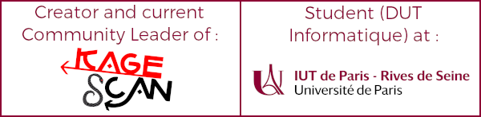

<table align="center"><tr><td>

    
💼 I'm currently looking for an internship in IT, near Paris - [LinkedIn: @LoganTann](https://linkedin.com/in/LoganTann/)  

</td><tr></table>
            
<h2 align="center">Hey there, I'm Logan :wave:</h2>

I'm a French CS student who loves programming and Kagerou Project, a Japanese mixed-media series !

What i'm doing in github :

- 📜 [Homework Projects masterlist](homeworks.md) : 40% of my free time is dedicated to studies & homeworks.  
    > *In average, I work and publish up to 4 digital projects each two months.*
- 😀 [@Kagescan](https://github.com/Kagescan) : A set of projects that I created 5 years ago, and in which I'm still managing  
    > *Within that same name, it's is first a community, but also a full-featured website and a fan-translation team*
- 🎓 [@SI-Cartesia-Junior](https://github.com/SI-Cartesia-Junior) : Maintaining apps and the IT infrastructure of the Junior Enterprise of our campus
    > *[@CPU-Paris](https://github.com/CPU-Paris/) : also Admin and Teacher for an inter-campus programming club I created this year*
- 📦 [@MaterializeCSS](https://github.com/materializecss) : Official maintainer for the fork of the popular front-end library based on Google's Material Design
      
A complete bio is available at my [Github Sponsor](https://github.com/sponsors/LoganTann) page !
