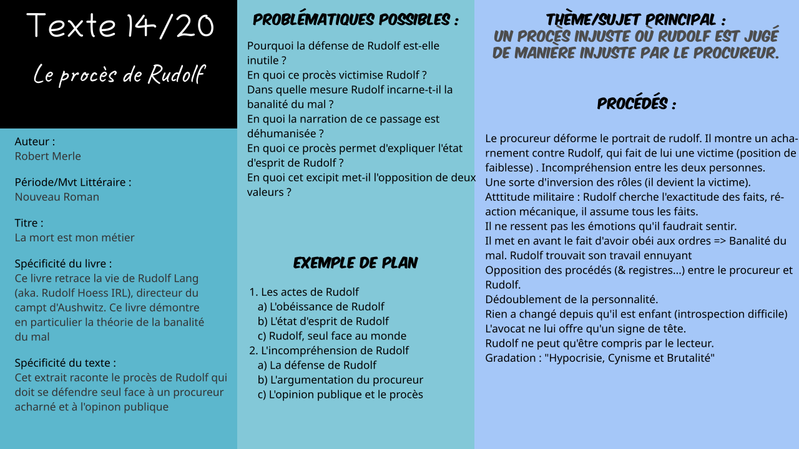

# Txt1 : dans *x*

*Logan Tann* - [Retour au menu](../)

**Plan vu en classe :**

1. 
   * 
   * 
   * 
2. 
   * 
   * 
   * 

__Problématique choisie__ : 

## Éléments sans rapport avec le plan vu en classe

* 

## I\ 

### a) 

* 

### b) 

* 

### c) 

* 

## II\ 

### a) 

* 

### b) 

- 

### c) 

* 

## Éléments supplémentaires

__Introduction__ : 

> 

__Conclusion__ :

> 

__Problématiques possibles__ : 

> * 

__Schéma Bilan__ : 

[Fichier Vectoriel (pour modification informatique)](txt14.svg)

Fichier PNG : 

