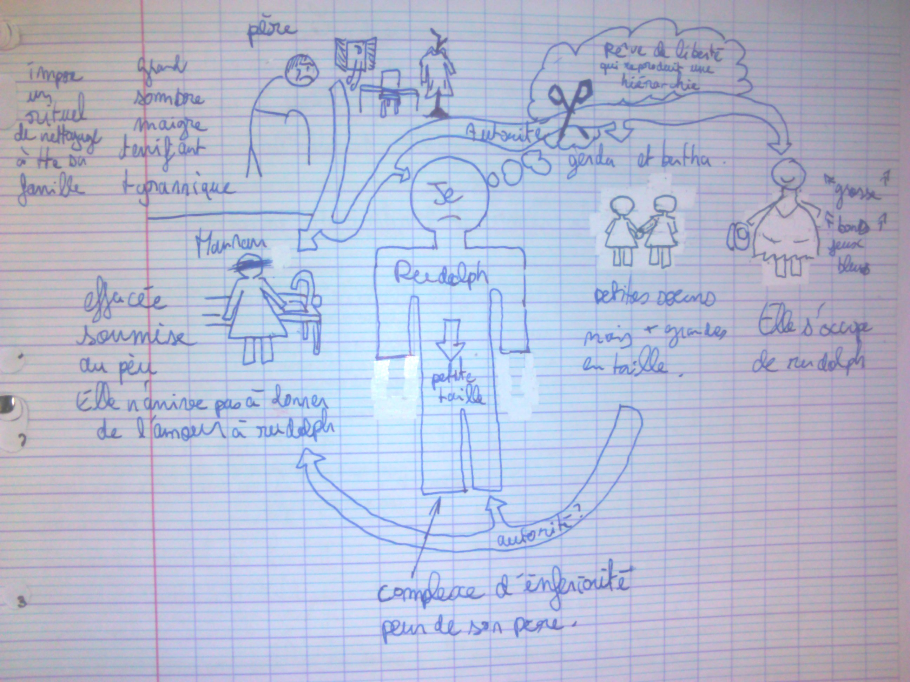
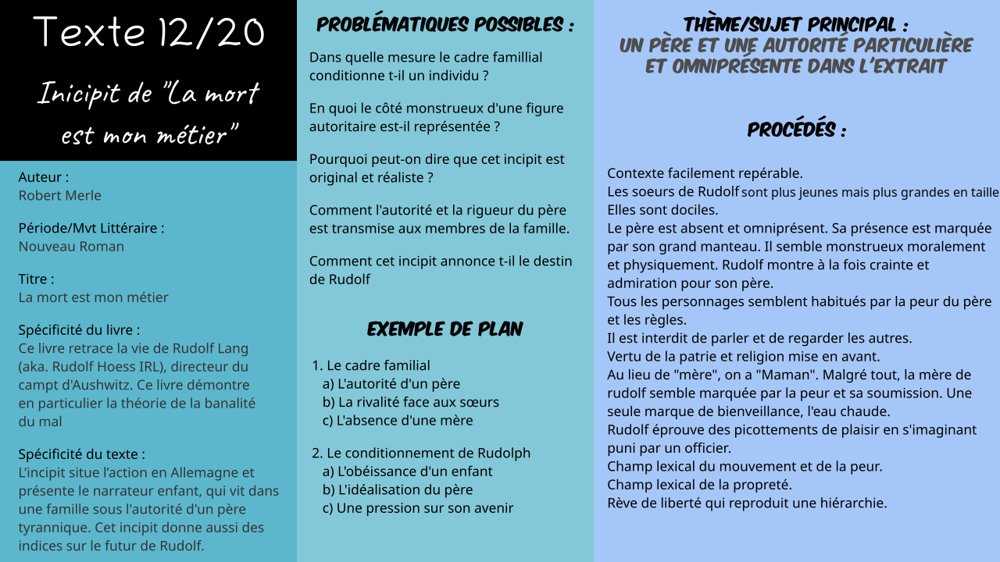

# Txt12 : Incipit de "La mort est mon métier"

*Logan Tann* - [Retour au menu](../)

Plan vu en classe : 

1. Le cadre familial
   * L'autorité d'un père
   * La rivalité face aux sœurs
   * L'absence d'une mère
2. Le conditionnement de Rudolph
   * L'obéissance d'un enfant
   * L'idéalisation du père
   * Une pression sur son avenir

## Informations importantes sans rapport avec le plan vu en classe

* On peut facilement repérer le lieu de l'action (kaiser allee, vertu **allemande**, prénoms allemands) et la date (Hiver). On apprend par ailleurs qu'il s'agit d'une famille principalement bourgeoise, son père est commerçant ("*il fait les comptes du magasin*").
* Le narrateur est Rudolph car il raconte à la première personne. On ne connaît pas vraiment son age mais on peut savoir qu'il n'est pas ado car il porte un bermuda. Il n'est jamais nommé !
* On sait également qu'il a deux sœurs plus petites que lui en age, mais plus grandes en taille (cet élément reviendra souvent dans le roman)
* Originalité de la narration : on présente un cadre familial au moment de la journée.
* On peut dire plein de choses sur Maria. C’est la première personne qui apparaît dans le roman après le narrateur, c’est un personnage positif, qui aide silencieusement le narrateur, celui-ci constate « *avec soulagement* » (l. 7) que c’est elle qui lui ouvre la porte. Elle est physiquement imposante et rassurante, elle est la seule à faire attention à lui, et est la seule que le narrateur remercie.Elle joue aussi le rôle que la mère n'assume pas, et elle contrebalance la menace que fait planer le père.
* Interdictions non parlées dans le plan de manière explicite : Interdiction de regarder par la fenêtre : absurde et impossible à respecter. Interdiction de se laver à l'eau chaude. La ponctualité instaure une grande place aussi car il s'agit de la "vertu allemande". `=> Regard constant sur l'heure, peu d'échanges, propreté excessive et presque maladive`

## I\ Le cadre famillial

### a. L'autorité d'un père

* Le père impose toutes les règles de la maison, et toute la famille doit s'y plier.
* Lorsque Rudolph se sent en retard, il imagine la voix de son père. **Le père est absent mais omniprésent**.
* La religion, la vertu et le patriotisme font partie des valeurs transmises / imposées par le père : vertu «*allemande* » de *ponctualité*; importance de *la faute* et de *la prière*
* Tous les personnages semblent habités par la peur du Père et de ses règles.

### b. La rivalité face aux sœurs

* Elles sont indissociables et interchangeables, sont toujours désignées par un pluriel : « *tes sœurs »,« Gerda et Bertha » , « Elles* ». Elles sont toutes les deux plus jeunes et *« plus grandes que [lui]* » . Ne parlent pas, ni entre elles, ni à leur frère, ne communiquent d’aucune manière.
* Elles sont zélées et dociles : *« déjà au travail », «l’une derrière l’autre»* .
* On aurait l'impression qu'il est interdit de se regarder dans la maison, entre Rudolph et ses sœurs mais aussi avec sa mère.

### c. L'absence d'une mère

* Désignée par le narrateur par le terme affectueux et enfantin de « *Maman* » (contrairement au "Père"). Elle semble définie par sa peur du père, par sa soumission.
* Champ lexical de la peur. Elle est complètement terrorisée par Père (pas de réponses à Rudolph etc...)
* Contrairement à Maria, elle semble incapable de protéger son fils. Le seul geste bienveillant a été le passage de l'eau chaude, refusé par Rudolph.
* Les seules paroles à son fils sont des remarques sur un manquement aux ordres. Rudolph est tellement soumis aux ordres du père, au point de les faire siennes, et sa mère lui obéit.

## II\  Le conditionnement de Rudolph

### a. L'obéissance d'un enfant

* Répond systématiquement "Oui, Maman" à sa mère.
* Il obéit à toutes les règles imposées, alors même qu'il n'y a personne pour le réprimander : « *je n'ouvris pas la bouche : On n'avait pas le droit de parler* », ou « *Je dis tout bas avec terreur : "Mon Dieu, faites que je n'aie pas regardé dans la rue "* »
* Lorsque sa mère enfreint une des règles du père, il le lui fait remarquer, comme un reproche : « *Mais c'est de l'eau chaude !* » 
* Lorsqu'il s'imagine puni par un officier, qu'il lui obéit « *avec respect* », il en éprouve des « *picotements* » de plaisir comme le prouve l'adverbe « *délicieusement* » `Note : Peut aussi faire le parallèle avec la partie II.C (une pression sur son avenir)`

### b. L'idéalisation du père

* « *Et ce fut comme si Père se dressait devant moi* » : le verbe 'dresser' évoque sa grande taille et une apparition miraculeuse et impressionnante.
* Le père semble monstrueux physiquement et moralement. Son physique est effrayant : "Noir", "Maigre", "Voix saccadée", "Raideur"...
* Le "Grand manteau noir" est presque comme une métonymie du père. « *les yeux brillants et le visage maigre de Père* » : personnage exalté.
* Rudolph considère son père comme un dieu ( et Majuscule sur père). Ses décisions sont donc invisibles et inexorables.
* Rudolph montre à la fois de la crainte mais aussi de l'admiration envers son père.

### c. Une pression sur son avenir

* Le narrateur se souvient qu'on était "Samedi" : le samedi est jour de nettoyage et jour où le narrateur doit avoir un entretien avec son père, qui le terrorise. Il y a un champ lexical du mouvement (sur les verbes en particulier) et sur la peur.
* La maison est très silencieuse et les personnes sont attentionnés avec le ton de la voix, or personne ne surveille => peur intériorisée. Il est interdit de parler.
* Le narrateur est fasciné par les portraits de ses aïeux en tenue militaire, et il prend surtout plaisir à obéir. Litanie d'actions, de descriptions de gestes, mais aucune analyse psychologique, aucun ressenti des personnages : qu'éprouve Rudolf, hormis le plaisir procuré par son imagination et la peur inspirée par le Père ? On l'ignore.
* Champ lexical du nettoyage => Parallèle avec la race parfaite?Le train et la fumée peut aussi faire penser aux camps de concentration ! Coïncidence ? Je pense pas !
* Rêve de liberté qui reproduit une hiérarchie. Tous ces éléments permettent de comprendre pourquoi Rudolf deviendra un Chef particulièrement obéissant, odieux d'obéissance, soumis à l'autorité et sans aucun jugement moral pour lui faire prendre conscience de l'atrocité de ses actes.

## Éléments cools

__Introduction :__ Je trouve celui sur internet quasi-parfait. Il suffit juste d'adapter ceci avec la problématique et votre plan. 

>Robert Merle est un écrivain français né en 1908 et mort en 2004. Sa vie a notamment été marquée par son emprisonnement en Allemagne pendant la seconde guerre mondiale, puis par le prix Goncourt qui lui a été discerné pour son roman *Week-end à Zuydcoote*. *La Mort est mon métier* est un roman qui retrace, sous la forme d'une autobiographique fictive, la vie du commandant d’Auschwitz, Rudolf Hoess, baptisé dans la fiction Rudolf Lang. 
>L’incipit situe l’action en Allemagne 1913 et présente le narrateur, enfant, qui vit dans une famille austère sous l'autorité d'un père tyrannique.

__Conclusion__

> Incipit réaliste, cadre historique précis, description d’une famille catholique rigide, en Allemagne, juste avant la déclaration de la 1ère guerre mondiale.
>
> Tous les personnages de la famille sont présentés, mais le plus important, celui qui régit la vie de tous, le Père, est absent des premières pages et n’apparaît qu’en dernier : effet d’attente pour le lecteur.
>
> Les facteurs qui vont permettre au narrateur de construire sa personnalité sont déjà donnés ou ébauchés : la rigidité, la peur, la honte, l’importance du regard d’autrui, l’absence d’amour criante dans ce cadre familial.
>
> On perçoit déjà que le narrateur est une sorte de double de son père (l’épisode de l’eau chaude), et qu’il a intériorisé une éducation fondée sur la terreur, les règles rigides et absurdes, l’indifférence à autrui.

__Problématiques possibles__

> Dans quelle mesure le cadre famillial conditionne t-il un individu ?
>
> En quoi le côté monstrueux d'une figure autoritaire est-il représentée ?
>
> Pourquoi peut-on dire que cet incipit est original et réaliste ?
>
> Comment l'autorité et la rigueur du père est transmise aux membres de la famille.
>
> Comment cet incipit annonce t-il le destin de Rudolf

__Schéma heuristique__

__Schéma bilan tout en un__

[Fichier vectoriel (pour modification informatique)](txt12.svg)

Fichier PNG: 
