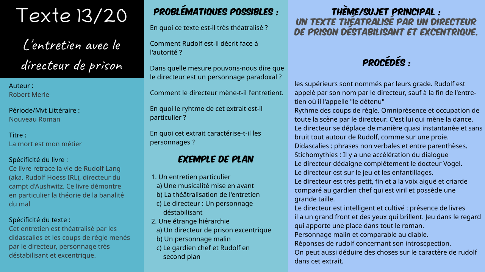

# Txt13 : L'entretien avec le directeur de la prison dans *La mort est mon métier*

*Logan Tann* - [Retour au menu](../)

**Plan vu en classe :**

1. Un entretien particulier
   * Une musicalité mise en avant
   * La théâtralisation de l'entretien
   * Le directeur : Un personnage déstabilisant
2. Une étrange hiérarchie
   * Un directeur de prison excentrique
   * Un personnage malin
   * Le gardien chef et Rudolf en second plan

__Problématique choisie__ : Comment le directeur mène-t-il l'entretien ? 

Les parties sont toutes composées de 4 à 5 points :)

## Éléments sans rapport avec le plan vu en classe

* Majuscule sur "Directeur", mais pas de majuscule pour "docteur"

* La règle est un symbole d'autorité, et le directeur s'en sert aussi pour pointer du doigt.

* Herr Director + Gardien chef : pas de noms. On les nomme par leur grade.

* Il s'agit du seul passage dans lequel le directeur est présent, autrement dit, on ne le voit pas dans la suite du livre.

* Argumentation logique du directeur :   

  > - - Arg. 1) : une maxime l.147 : « Tous les hommes honnêtes sont dangereux » (présent de vérité général + généralisation par « tous les ») … qui n'explique pas grand-chose.
  >   - Arg.2 : Il utilise un argument *a contrario,* c'est-à-dire par le contraire : il explique ce que sont les canailles (des gens inoffensifs) pour qu'on en déduise ce que sont les gens honnêtes (dangereux). L'explication n'étant pas plus convaincante que la précédente (le gardien-chef avoue ne pas comprendre pourquoi l.150), le directeur continue :
  >   - Il introduit la véritable explication par un connecteur logique « parce que » l.153. Explication très sommaire (elle tient à peine 1,5 ligne) et seulement de l'argument *a contrario* ; ce sera donc au lecteur (et à Rudolf, et au gardien-chef) d'en déduire l'implication : les canailles agissent « par intérêt », sous-entendu les gens honnêtes agissent par désintérêt, par idéologie (politique, religieuse). Or on sait que Rudolf est en prison parce que son idéologie l'a poussé à l'assassinat (= terrorisme). Le Directeur semble donc bien avoir raison.

## I\ Un entretien particulier

### a) Une musicalité mise en avant

* **Rythme des coups de règles** : La règle est aussi comparable au bâton d'un chef d'orchestre. Il ponctue ses phrases par des coups de règle, geste rapporté à chaque fois dans des phrases non verbales et parfois entre parenthèses ce qui donne un effet comique : geste compulsif étrange et comique. 
* Omniprésence et occupation de toute la scène par le Directeur. C'est lui qui mène la danse.
* Cascade de Ah! Ah! (Se rapproche aussi au comique de mots pour la sous-partie suivante.)
* Le directeur se déplace sans bruit, et de manière quasi-instantanée.

### b) La théâtralisation de l'entretien

* Il y a présence de phrases non verbales et entre parenthèses qui rappellent les didascalies, alors que ce texte est tiré d'un roman.
* Stichomythies : Il y a une accélération du dialogue.
* Les coups de la règle servent aussi à montrer le décor (*Respectivement : une lettre, une règle, une fenêtre, un rayonnage de livres, un objet en bois, une table, une petite statuette en bronze, un fauteuil*)
* Des déplacements marqués : le Directeur ne cesse de passer devant et derrière Rudolf = jeu de scène visuel.
* Comique de geste visible hors du dialogue, dans des sortes de didascalies (exemples présents dans II.A) Ces comiques peuvent faire penser à la *Comedia dell arte* , et le personnage est proche d’Arlequin ou d’un valet rusé de comédie.  
  Une sortie décalée : « Et on sortit presque en courant », ce qui contraste avec l'attitude immobile de Rudolf et du garde pendant toute la scène => effet comique

### c) Le directeur : Un personnage déstabilisant

* On remarque la nervosité exacerbée du Directeur, son caractère imprévisible (« *et tout d'un coup* », « *subitement* », « *sans transition* » ) et ses changements d'humeur : sourire, air furieux, sourire de nouveau, air sérieux, etc. 
* Dédaigne complètement le Dr Vogel.
* Les déplacements du directeurs sont quasi instantanés : il se déplace comme s'il se téléportait (derrière son dos puis subitement devant lui)
* Répétition de « intéressant ! » avec demande de confirmation au gardien-chef pour finalement ne rien lui faire dire. *(Peut se rapporter aussi au comique dans la théâtralisation)*

## II\ Une étrange hiérarchie

### a) Un directeur de prison excentrique

* Rappel : `Excentrique : Dont l'apparence s’écarte (presque volontairement) des habitudes sociales`
* Le directeur est sur le jeu et les enfantillages, contrairement aux interrogatoires traditionnels. 
* Un physique contradictoire entre le gardien chef et le directeur. En effet, le directeur est très petit, fin et a la voix aiguë et criarde comparé au gardien chef qui est viril et possède une grande taille.
* Les sautillements sont les seuls moyen de déplacement du directeur. Il se déplace très rapidement, et est comparé à un singe. Il fait des grimaces ce qui fait de lui un personnage burlesque (mélange vulgaire et noble).
* Étonnement du directeur à la fin du texte, alors qu'il avait parlé durant un long moment.

### b) Un personnage malin

- Le directeur est intelligent et cultivé : présence de livres et d'une bibliothèque dans toute la pièce, il a un grand front et des yeux qui brillent `Note : On se souvient que le regard a une importance fondamentale pour Rudolf : celui qui regarde droit dans les yeux est celui qui sait ou qui cherche à savoir comme avec son père ou Maria. Le Directeur semble clairvoyant.`
- Il minimise le savoir du docteur Vogel : il tient sa lettre « très loin de lui d’un air dégoûté » et « la soulève du bout des doigts » . Accentuation ironique lorsque la conversation parle du docteur; il en est de même pour son sourire. Pour finir, il y a la répétition du "Savant" docteur Vogel.
- Il oppose son pouvoir contre celui du docteur. de fait, le Directeur peut faire sortir Rudolf de prison, contrairement au Dr Vogel. 
- Comparable au diable *+Deus Ex Machina* ? En effet, il sait que Rudolf est dangereux et veut réduire sa peine de prison pour le rendre libre plus rapidement. Il tente Rudolf et remets en question le savoir de son tuteur. Rappelons aussi que "Malin" fait penser au diable.
- Derrière cet étrange personnage se cache un redoutable psychologue, ou prophète... (image du savant fou ou du bouffon qui a le droit de dire la vérité). Il semble lire dans Rudolf.

### c) Le gardien chef et Rudolf en second plan

* Les réponses de Rudolf montrent de l'hésitation car elles sont à propos de sa propre introspection.
* Le gardien chef et Rudolf ont une posture militaire et sont complètement soumis au Directeur. Les réponses sont courtes.
* Le directeur semble être complice avec Rudolf, comme lorsque qu'il prend sa défense (de "prendre son temps") face au gardien chef.
* Rudolf est comparable à une proie car le docteur tourne autour de lui furtivement et sans bruit. (On peut aussi faire le parallèle avec la soif de savoir du directeur sur de l'inconnu. Le directeur semple admirer Rudolf et à la fin de l'entretien, il fait sa conclusion et ne l'appelle plus par son prénom mais "Le détenu")
* Rudolf apparaît alors comme naïf *(considère le docteur comme savant juste par son statut de médecin)*, dépourvu de capacité d'analyse *(Répond facilement par oui ou non, mais pas aux questions le concernant)*, honnête et désintéressé *(refuse de feindre sauf dans l’intérêt de sa patrie et ne prend donc pas en considération son intérêt personnel)*, et inoffensif. Mais il apparaît aussi froid, inhumain et fanatique de sa patrie.

## Éléments supplémentaires

__Introduction__ : 

> Éléments d'introductions présent dans le [Texte 12](txt12.md)
>
> Contexte de l'extrait : Après une éducation rigoriste et austère, Rudolf trouve sa voie dans
> l'armée. Après sa démobilisation, il se retrouve désœuvré, sans argent, et cherche à mettre fin à ses jours. Il retrouve un sens à sa vie en s'engageant chez les S.A., ce qui le rend pour la première fois « heureux ».Il est alors condamné à 10 ans de prison pour avoir accepté et tué un traître des S.A. Au bout de 3 ans, le Docteur Vogel, son tuteur, lui propose dans une lettre de l'amnistier s'il accepte
> de devenir prêtre, conformément à la volonté de son père. Rudolf n'ayant pas répondu à ce courrier, est convoqué par le Directeur de la prison. 

__Conclusion__  (entièrement handmade :3 ): 

> Pour conclure, le directeur occupe une très grande place dans cet extrait et mène l'entretien. Cela s'explique en effet par la théâtralisation du texte par les phrases apparentées en didascalies. La scène s'apparente aussi à un véritable orchestre menée par les coups de règles du directeur, personnage très déstabilisant et excentrique. En effet, il y a un véritable contraste physique et moral entre le directeur de la prison et le gardien-chef. Le directeur, d'apparence très cultivée, se comporte comme si Rudolf était sa proie car celui-ci amène sa curiosité.

__Schéma Heuristique__ : 

> (non)

__Schéma Bilan__ : 

[Fichier vectoriel pour modification informatique](txt13.svg)

