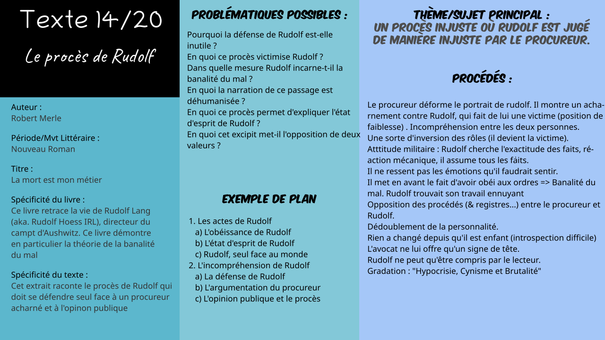

# Txt14 : Le procès de Rudolf dans *La mort est mon métier*

*Logan Tann* - [Retour au menu](../)

**Plan vu en classe :**

1. Les actes de Rudolf
   * L'obéissance de Rudolf
   * L'état d'esprit de Rudolf
   * Rudolf, seul face au monde
2. L'incompréhension de Rudolf
   * La défense de Rudolf
   * L'argumentation du procureur
   * L'opinion publique et le procès

__Problématique choisie__ : Dans quelle mesure Rudolf incarne t-il la banalité du mal ?

## Éléments sans rapport avec le plan vu en classe

* Ceux du fichier que le prof a donné. Tous les éléments du cours répondent à la problématique, mais si la problématique porte sur l'argumentation du procureur, alors il est aussi conseillé de consulter [le fichier](../sources/txt14.docx) que le prof a envoyé sur ecole directe.

## I\ Les actes de Rudolf

### a) L'obéissance de Rudolf

* Réaction mécanique, Attitude toujours militaire.
* Il assume tous ses actes. Rudolph montre bien son acceptation à liquider tous les juifs pour sa nation, il  était un simple subordonné.
* Rien n'a changé depuis qu'il est enfant.
* Par contre, comme dans la scène d’interrogatoire avec le directeur de la prison, Rudolf a besoin de temps pour répondre à une question concernant son avis via introspection.

### b) L'état d'esprit de Rudolf

* La réplique de Rudolph s'intéresse uniquement à l'exactitude des faits. Émotionnel => Rationnel. Il prends en flagrant délit le procureur en train de déformer les propos de la déposition.
* Il ne ressent pas les émotions qu'il devrait ressentir, en autre termes, il est spectateur de son propre procès.
* Il est aussi monstrueux car il est détaché du réel . Deux personnalités, indifférence de la cruauté des ordres mais vit quand même une vie familiale tout à fait normale.
* Les morts sont juste des chiffres. Il met aussi en avant le fait d'avoir obéi aux ordres.
* **Banalité du mal !**

### c) Rudolf, seul face au monde

* Position de faiblesse, tout le monde est contre lui.
* L'absence de défense entraînera alors une totale décrédibilisation de Rudolf (Nous allons y venir dans des parties futures)
* L'avocat ne lui offre qu'un signe de tête et reste distant avec son client.

## II\ L'incompréhension de Rudolf

### a) La défense de Rudolf

* Rudolf semble assurer sa défense tout seul.
* Rudolf ne peut qu'être compris par le lecteur.
* Inversion des rôles : Rudolf devient la victime d'un procès qui n'est pas juste/pas impartial à cause du procureur, qui lui, est plutôt associé comme un monstre dans son acharnement.
* Il n'était pas question de gentillesse dans son travail. Rudolph trouvait se travail juste ennuyant et même fatiguant. Seulement, ses propos sont inacceptables pour ce genre de situation.

### b) L'argumentation du procureur

- Le procureur peint un portrait déformé de Rudolf, c'est à dire qu'il n'est pas exact sur ses faits. Cela montre un véritable acharnement sur la future victime. Il essaie de faire dire à Rudolf que c'était un plaisir.
- Il y a une opposition entre le discourt de Rudolf et celui du procureur, et donc une incompréhension entre les deux hommes. Il y a en fait deux points de vue.
- Quelques procédés rhétoriques : une double négation (« vous ne pouvez nier que » = litote = accentue en disant moins), une question rhétorique (« c'est donc que »); présence de connecteur logiques.
- Le procureur persuade son auditoire en utilisant des hyperboles *("Horrible", remplacement du terme enfant par "bébés")* et le registre pathétique. Il utilise aussi le registre polémique pour décrédibiliser Rudolf, et bien entendu, des hyperboles. Il justifie ses propos en fonctionnant sur les émotions.
- Dédoublement de personnalité : c'est l'argument qui mettra terme à la défense de Rudolf.  
  Est-ce vraiment une victoire pour le procureur ?

### c) L'opinion publique et le procès

* Arguments déformés influent sur l'opinion publique : 
  * A fait preuve de zèle : Oui mais uniquement dans sa tâche et pas dans les ordres
  * N'a rien fait pour se libérer de ses fonctions : Si, mais avant Auschwitz
  * Ce travail plaisait à Rudolf : seul recevoir des ordres plaisait au protagoniste, mais il trouvait ce travail ennuyant.
* Dans le contexte d'après guerre il n'est pas étonnant que personne prenne sa défense : l’opinion publique met la pression sur le procès. (On pourra aussi parler de l'affaire du pull over rouge et de la peine de mort en tant qu'ouverture si on veut choisir le thème de l'opinion publique.)
* Gradation : Hypocrisie, cynisme et brutalité.

## Éléments supplémentaires

__Introduction__ : 

> Éléments d'introductions présent dans le [Texte 12](txt12.md)
>
> Contexte de l'extrait : Cet extrait raconte le procès final de Rudolf qui doit se défendre face au procureur, et constitue l'excipit de l'histoire

__Conclusion__ :

> Le procès de Rudolf illustre parfaitement la théorie de la brutalité du mal d'Hanna Artendt car on se rend compte que Rudolf utilise les ordres reçus pour justifier ses actes monstrueux. Ainsi, il ne semble pas préoccupé par les erreurs et les imprécisions du procès , et ne comprend pas non plus les arguments qui font appel aux émotions. Le lecteur peut éprouver de la sympathie/pitié pour ce personnage incompris et mal décrit par le procureur.

__Problématiques possibles__ : 

> * Pourquoi la défense de Rudolf est-elle inutile ?
> * En quoi ce procès victimise Rudolf ?
> * Dans quelle mesure Rudolf incarne-t-il la banalité du mal ?
> * En quoi la narration de ce passage est déshumanisée ?
> * En quoi ce procès permet d'expliquer l'état d'esprit de Rudolf ?
> * En quoi cet excipit met-il l'opposition de deux valeurs ?

__Schéma Bilan__ : 

[Fichier Vectoriel (pour modification informatique)](txt14.svg)

Fichier PNG : 

