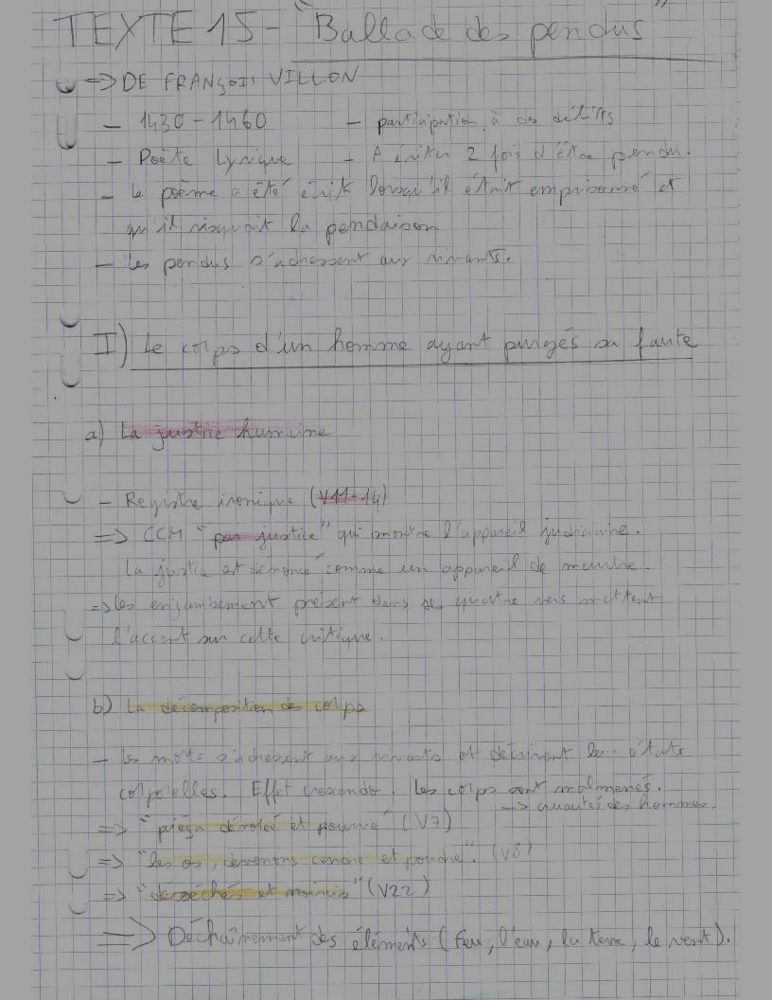
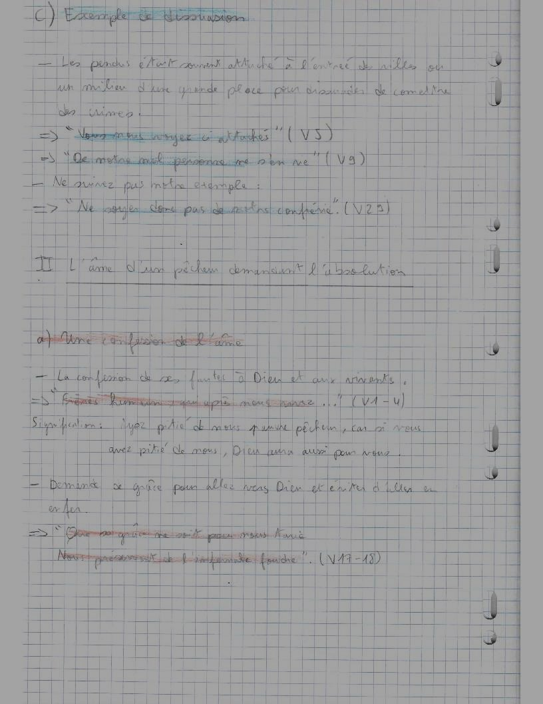
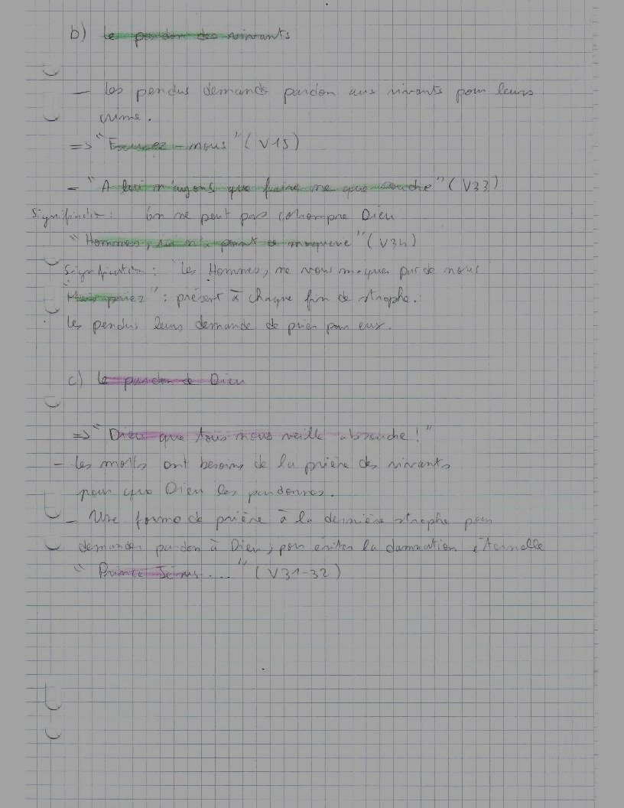
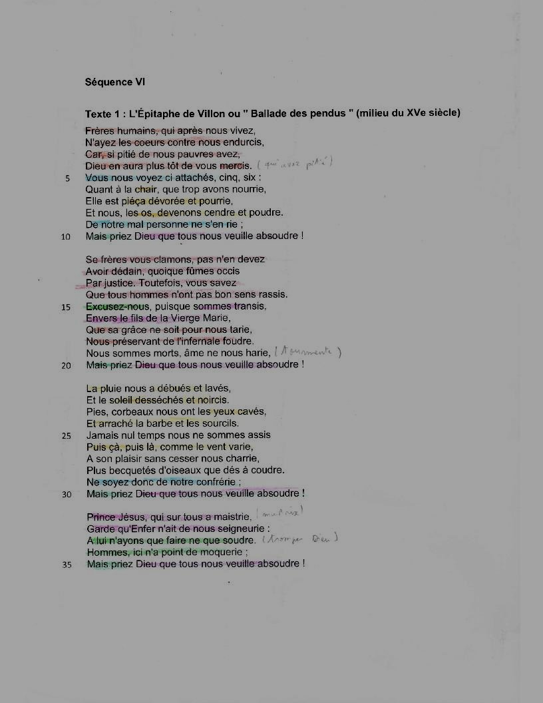

# Txt15 : La ballade des pendus

*Jean DIAS ALVEZ* - [Retour au menu](../)

**Plan vu en classe :**

1. Le corps d'un homme payant sa faute.
   * a) La justice humaine
   * b) La décomposition des corps
   * c) Exemples de dissuasion
2. L'âme d'un pêcheur demandant l'absolution
   * a) Une confession de l'âme
   * b) Le pardon des vivants
   * c) Le pardon de Dieu

__Problématique choisie__ : Comment ce texte montre-t-il une dualité entre le corps et l'âme.

## Éléments sans rapport avec le plan vu en classe

* Le mort parle : il s'agit d'une prosopopée.

## Éléments de connaissance littéraires : 

* Fantastique : Une histoire qui introduit un univers réel faisant intervenir une étrangeté.
* Métonymie : Désignation de qqch par un mot qui désigne autre chose. EX : Tout paris était dehors.
* Mémento moris : Un texte affiché sur la tombe d'un mort, texte que ladite personne pouvait choisir avant de mourir.
* Présent d'énonciation : le véritable présent ≠ Présent de narration : dans le passey
* Sophisme : Socrate est un homme, un homme est mortel donc Socrate est mortel.

*Logan Tann*

## I\ Le corps d'un homme payant sa faute.

### a) La justice humaine

* 

### b) La décomposition des corps

* Nourrie, pourrie : le gore accentue le choc. De plus, il y a une très grande opposition entre ces mots.

  os, cendre, poudre + piéça dévorée et pourrie + .... : présence de nombreuses gradation.

* Le mort rappelle que tous les hommes mourront tôt ou tard.

### c) Exemples de dissuasion

* Usage de l'impératif dans le vers 2 : ordre.
* Utilisation de connecteurs logiques.
* 
* Prosopopée; Usage du présent d'énonciation, le mort s'adresse directement aux vivants.

## II\ L'âme d'un pêcheur demandant l'absolution

### a) Une confession de l'âme

* Appel à la compassion. Métonymie du cœur.
* 3e personne => prise de recul

### b) Le pardon des vivants

- Le mort demande le pardon des vivants
- Présence du "nous",  frères humains : complicité entre le lecteur et le mort
- Impératif avec demande de grâce

### c) Le pardon de Dieu

* Champ lexical du pardon.
* "Car si pitié de nous avez, Dieu en aura plus tôt de vous merci" : Appel à la compassion, argument qui fait des pendus des protégés de Dieu, au mème titre des Frères humains.
  Ressemble à un chiasme.

## Éléments supplémentaires

__Introduction__ : 

> 

__Conclusion__ :

> Ce poème montre que le corps et l'âme sont séparés tout en restant liés l'un à l'autre. En effet, la forme même de cette bataille qui présente certaines strophes consacrées au corps et l'autre consacrées à l'âme nous renvoie à cette dualité.
>
> Il ne faut pas omettre que la prosopopée set de "memento moris" car le premier expose la déchéance de son corps et montre la détermination de son âme à obtenir le pardon pour toute l'humanité.
>
> Cette ballade peut également être comparée à la ballade des mercis.

__Problématiques possibles__ : 

> * Quel message transmet le criminel mort aux vivants ?
> * En quoi le mort transmet-t-il un message aux vivants ?
> * En quoi la description monstrueuse dissuade-t-elle les vivants de suivre la voie du crime ?

__Schéma Bilan__ (à venir): 

> [Fichier Vectoriel (pour modification informatique)](txt1.svg)
>
>  Fichier PNG : 
>
> 