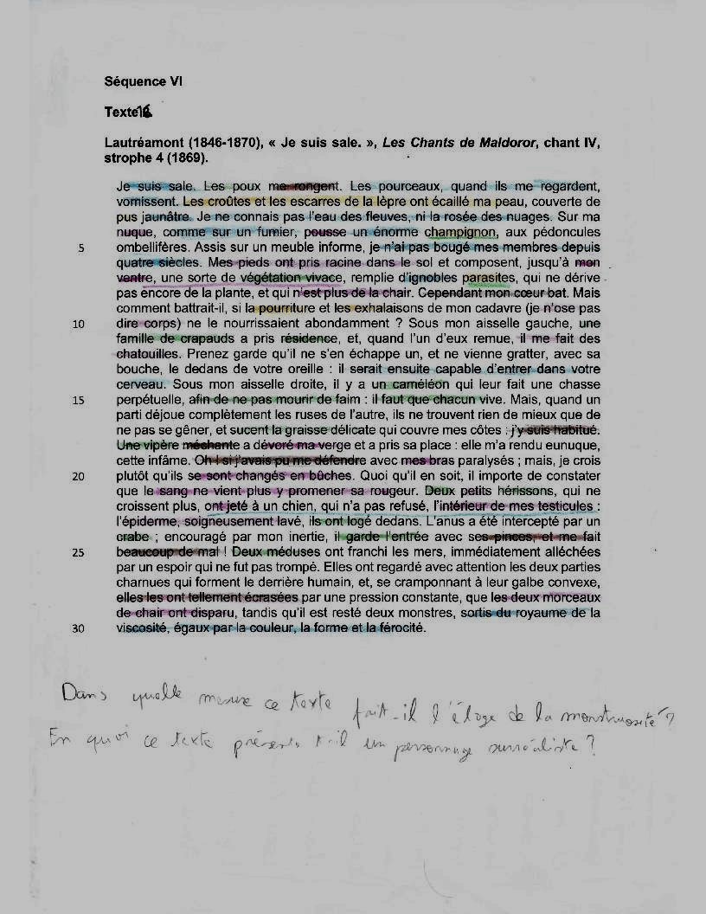

# Txt16 : Je suis sale dans *Les chants de maldoror (c IV,str 4)*

[Retour au menu](../)

*Jean Dias Alvez* :

*Logan Tann* :

**Plan vu en classe :**

1. Un monstre fantaisiste
   * Un cadavre monstrueux ...
   * ... Qui abrite la vie
   * Une métamorphose impossible
2. Un autoportrait ironique
   * Un ego qui assume le dégoût
   * Un être victime de sa condition
   * Un humour dénonçant la recherche de la beauté.

__Problématique choisie__ : En quoi ce texte présente-t-il un personnage surréaliste ?

## Éléments sans rapport avec le plan vu en classe

* Freud : Le père de la psychanalyse.

## I\ Un monstre fantaisiste

### a) Un cadavre monstrueux ...

* Cadavre qui gît depuis des siècles au même endroit => quasi décomposé.
* Champ lexical du cadavre et du corps. Description de chaque parties du corps.
* Corps à composition d'homme mais complètement déshumanisé.

### b) ... Qui abrite la vie

* Beaucoup d'animaux : Poux, caméléons, grenouilles, vipères, crabe, méduses, hérissons
* Animaux en extérieur : Pourceaux et chiens.
* Végétation tout aussi présente : Champignons dans la nuque, bûche à la place des bras, végétation vivace dans le ventre.

### c) Une métamorphose impossible

* Ses pieds sont enracinés, son corps se rapproche d'un arbre.
* Environnements différents : Terre puis Mer (paradoxe).

## II\ Un autoportrait ironique

### a) Un ego qui assume le dégoût

* Humour noir.
* Ne se déplaît pas, apprécie aussi son état actuel.

### b) Un être victime de sa condition

- Subit une douleur (avec le crabe et la vipère qui mangent/pincent son corps), même si acceptée.
- Hyperboles présentes.
- Le fait de subir les évènements s'accentue avec l'utilisation de la voix passive.

### c) Un humour dénonçant la recherche de la beauté.

* Paradoxe : Un être mort qui parle et est plein de vie.

## Éléments supplémentaires

__Introduction__ : 

> voir les éléments donnés par Jean

__Conclusion__ :
> Il n'est pas étonnant, à la lecture de cet extrait, que Lautréamont ait suscité tant d'enthousiasme chez les surréalistes.L'auteur tourne en effet le dos à la narration réaliste pour évoquer un monstre improbable et hyperbolique qui concentre en lui tous les traits de la monstruosité.
> Par les fantasmes qu'il développe, le texte offre une riche palette des manifestations de l'inconscient et fera les délices de la psychanalyse.
> Par ailleurs, le ton décalé et le style somptueux et poétique ne pouvait que plaire à André Breton, le pape ou le chef de file du surréalisme qui le cite dans son anthologie de l'humour noir : « Pour nous, il n'y eut d'emblée, pas de génie qui tends devant celui de Lautréamont »

 __Problématiques possibles__ : 
> * Dans quelle mesure ce texte fait-t-il l'éloge de la monstruosité ?
> * En quoi ce texte est humoristique/emploie une forme ironique ?
> * En quelle mesure ce texte met-il en avant la beauté de la nature ?

__Schéma Bilan__ : 

[Fichier Vectoriel (pour modification informatique)](txt14.svg)

Fichier PNG : 

