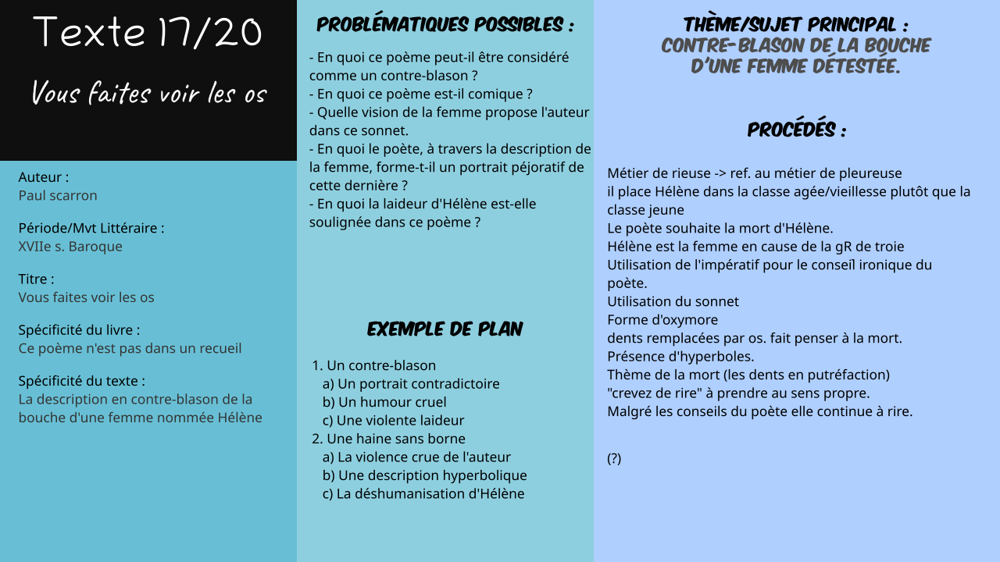

# Txt17 : Vous faites voir les os de *Paul Scarron*

*Logan Tann* - [Retour au menu](../)

**Plan vu en classe :**

1. Un contre-blason
   * Un portrait contradictoire
   * Un humour cruel
   * Une violente laideur
2. Une haine sans borne
   * La violence crue de l'auteur
   * Une description hyperbolique
   * La déshumanisation d'Hélène

__Problématique choisie__ : Comment l'auteur retranscrit-il son ressentiment ?

## I\ Un contre-blason

### a) Un portrait contradictoire

* Le blason est un art consistant à décrire une partie du corps d'une femme, souvent élogieux. Ici le poète fait tout le contraire afin de lui déclarer toute sa haine.
* Rieuse/pleureuse : thème de la vieillesse . Paul Scarron rejette Hélène de la beauté et de la jeunesse en l'amenant vers la vieillesse et la mort.

### b) Un humour cruel

* Le métier de rieuse : il n'existe pas mais fait référence au véritable métier de pleureuse.
* Utilisation d'un sonnet (deux quatrains et deux tercets), la forme la plus pure pour parler d'amour.
* Malgré les conseils du poète, Hélène continue toujours à rire dans le second tercet.
* Conseil ironique du poète. Il utilise de l'impératif.

### c) Une violente laideur

* L'halène qui déchausse
* Dentition pourrie
* Le second vers correspond au moment au le poète voit Hélène sourire. description péjorative.

## II\ Une haine sans borne

### a) La violence crue de l'auteur

* Animalisation de souhait de mort de l'auteur. Détestation.
* Le choix du prénom Hélène : dans la mythologie grecque, elle est la cause de la guerre de troie. Le prénom est introduit dès le premier vers.
* "Crevez de rire" : à prendre au sens propre; le poète l'invite à mourir sous son rire. Peut aussi prendre le sens "éclatez" ce qui rend sa mort plus violente.

### b) Une description hyperbolique

- "Os guerre blancs"; "Noirs comme de l'ébène" : forme d'oxymore.
- "carriées et tremblants" les dents sont en putréfaction.
- Répétition du mot "rire"; insistance.

### c) La déshumanisation d'Hélène

* Ses dents sont si grosses que le poète les qualifie d'*os*. Le mot "Os" nous fait penser à la mort.
* Le rire ne peut être arrêté, jusqu'à devenir destructeur.
* Dernier vers, souhait de l'auteur de la mort de la femme.

## Éléments supplémentaires

__Introduction__ : 

> Paul Scarron est un auteur contemporain du XVII e siècle. Atteint d'une maladie qui paralysa son corps, il passa le reste de sa vie dans un fauteuil et commence à écrire des œuvres comiques dont le poème Vous faites voir les os, qui est en fait une description en contre-blason de la bouche d'une femme nommée Hélène. Comment l'auteur retranscrit-il son ressentiment ?
>
> Nous répondrons à cette problématique en deux grandes parties : d'une part avec l'étude du contre-blason où nous verrons que le portrait fait par l'auteur est contradictoire, qu'il utilise un humour cruel avec une violente laideur, et d'autre part avec l'étude d'une haine sans borne où nous traiterons la violence crue de l'auteur, la description hyperbolique et la déshumanisation d'hélène.

__Conclusion__ :

> Paul Scarron exprime son ressentiment envers une femme dont la bouche l'incommode. Il a, pour cela, choisi la forme du sonnet (la forme la plus noble pour chanter l'amour) ce qui est paradoxalement judicieux pour critiquer et déclarer sa haine à cette femme. Paul scarron va ainsi à l'encontre des convenances artistiques de l'époque en choisissant le thème de contre-blason.
> Nous pouvons également remarquer que le rire insupportable d'Hélène peut rappeler à bien des égards le rire provoqué par la bouche déformée de Gwynplaine, personnage principal de «L'homme qui rit» de Victor Hugo.

__Problématiques possibles__ : 

> * En quoi ce poème peut-il être considéré comme un contre-blason ?
> * En quoi ce poème est-il comique ?
> * Quelle vision de la femme propose l'auteur dans ce sonnet.
> * En quoi le poète, à travers la description de la femme, forme-t-il un portrait péjoratif de cette dernière ?
> * En quoi la laideur d'Hélène est-elle soulignée dans ce poème ?

__Schéma Bilan__ : 

[Fichier Vectoriel (pour modification informatique)](txt17.svg)

Fichier PNG : 

