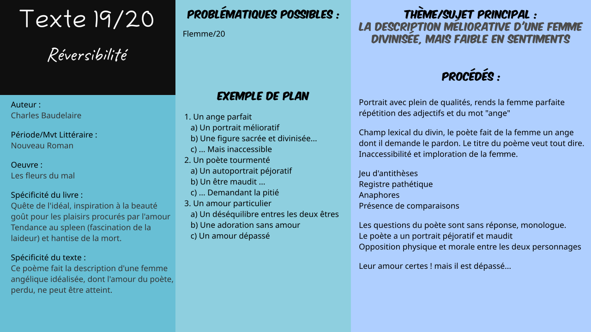

# Txt19 :  Réversibilité dans *Les fleurs du mal*

*Jean DIAS ALVEZ* - [Retour au menu](../)

**Plan vu en classe :**

1. Un ange parfait
   * a) Un portrait mélioratif
   * b) Une figure sacrée et divinisée...
   * c) ... Mais inaccessible
2. Un poète tourmenté
   * a) Un autoportrait péjoratif
   * b) Un être maudit ...
   * c) ... Demandant la pitié
3. Un amour particulier
   * a) Un déséquilibre entres les deux êtres
   * b) Une adoration sans amour
   * c) Un amour dépassé

__Problématique choisie__ : Comment l'auteur retranscrit-il son ressentiment ?

## I\ Un ange parfait

### a) Un portrait mélioratif

* L'être aimée est pleine de qualités que lui attribue le poète (Plein de Gaieté, Bonté, Santé, Beauté, Bonheur et de Joie)
* Le poème est construit de façon a faire de l'être aimé un modèle de la femme parfaite. "corps enchanté" vers 23.
* Répétition des adjectifs, formes d'anaphores : insistance sur les qualités de la femme.

### b) Une figure sacrée et divinisée...

* Répétition du nom commun *Ange* en début de vers (1, 5, 6, 10, 11, 15, 16, 20, 21, 25) . Poème d'apparence en un bloc, peut en fait être découpé en quatre strophes.
* "Aux émanations" (V 23), "De lumière" (V 21, 25) : corps divin
* "Les prières" : caractéristiques du divin
* **champ lexical du divin**

### c) ... Mais inaccessible

* Il pose une question à l'être aimé et pour être entendu, il repose sa question :
  * "Connaissez-vous l'angoisse ?", vers 1 et 5
  * "Connaissez-vous la haine ?", vers 6 et 10
  * "Connaissez-vous les fièvres ?", vers 11 et 15
  * "Connaissez-vous les rides ?", vers 16 et 20
* Seulement, ses questions restent sans réponse. De plus, le poète fait un monologue, il est seul.
* "Soleil rare" (V 14) met l'accent sur son inaccessibilité, ainsi que l'imploration du poète ("Implore").

## II\ Un poète tourmenté

### a) Un autoportrait péjoratif

* À l'inverse le questionnement permet de se dresser un autoportrait du poète : Il ressent des émotions négatives. (la honte, les remords, les tourments; vers 2, 3 et 17)

### b) Un être maudit ...

- Poète sombre et maléfique : poings crispés dans l'ombre vers 7, lames de fiel (signifiant amertume et haine).
- Désir de vengeance, infernal rappel ≠ de l'ange qui représente la paix

### c) ... Demandant la pitié

* Le poète implore la pitié de l'être qu'il aime en lui demandant de prier pour lui.
* Le titre "réversibilité" : si on prie, alors on a des chances de pouvoir être sauvé.
* Registre pathétique

## III\ Un amour particulier

### a) Un déséquilibre entres les deux êtres
* Les deux personnes sont opposées physiquement et moralement. L'être aimé est donc représenté par un ange, et est l'allégorie de la femme parfaite.
* Le poète est un homme maudit aux émotions négatives.
* __/!\\__  L'idéal est représenté par une femme, et le poète par le spleen : deux choses totalement opposées dont la relation ne tient pas.
* Jeu d'antithèses : gaieté - angoisse, bonté - haine, santé - Fièvres, beauté - rides…

### b) Une adoration sans amour
* Respect du poète pour l'être aimé car l'idéalise, mais sans plus.

### c) Un amour dépassé
* Cet amour est dépassé, on peut le remarquer en déchiffrant le sens de ces trois vers : 
  * "Qui compriment le cœur par le comme un papier que l'on froisse" vers 4 : Comparaison. Le cœur du poète est comprimé et froissé par la fin de leur relation.
  * "Comme des exilés, s'en vont d'un pied traînard" vers 13 : Comparaison. L’adjectif "traînant" qualifiant le nom commun pied montre que le poète est profondément touché par sa rupture.
  * "Dans des yeux où longtemps burent nos yeux avides" vers 19 : Les yeux avides du poète et de l'être aimé reflète leurs amour. Mais l'adverbe longtemps montre que l'amour est dépassé !

## Éléments supplémentaires

__Introduction__ : 

> Charles Baudelaire est un poète du XIX° siècle qui a écrit de nombreuses critiques d’art et a traduit les romans fantastiques d’Edgard Allan Poe. Baudelaire est un des premiers poètes qui développe la poésie en prose dans des œuvres comme **Le spleen de Paris** ou **Petits poèmes en prose**. Il est surtout connu pour son recueil **Les fleurs du mal** publié en 1857. Ce recueil exprime à la fois la quête de l’idéal, l’inspiration à la beauté et le goût pour les plaisirs procurés par l’amour. Cependant, on y trouve aussi la tendance au spleen, la fascination pour la laideur et la hantise de la mort de ce même poète.

__Conclusion__ :

> Le poète Réversibilité nous montre une femme angélique idéalisée. L'auteur exprime au cours de son poème son amour avec cette femme, désormais dépassé et impossible à atteindre, en lui faisant une description méliorative mais avec peu de sentiments.
>
> Le poète demande pitié à la femme tout en utilisant des éléments religieux afin de tenter une chance d'être sauvé (d'où le nom Réversibilité) et fait un autoportrait qui est, contrairement à la femme aimée, péjoratif.
>
> En termes d'ouverture, nous pouvons remarquer que le portrait mélioratif de la femme est vraiment différent d'un autre poème des fleurs du mal, qui est Causerie. En effet, dans Causerie, la femme est complètement diabolisée contrairement au poème précédemment vue où celle-ci est divinisée.

__Schéma Bilan__ : 

[Fichier Vectoriel (pour modification informatique)](txt19.svg)

Fichier PNG : 

