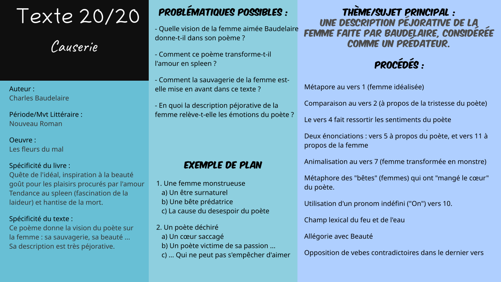

# Txt20 : Causerie dans *Les fleurs du mal*

*Logan Tann* - [Retour au menu](../)

**Plan vu en classe :**

1. Une femme monstrueuse
   * a) Un être surnaturel
   * b) Une bête prédatrice
   * c) La cause du desespoir du poète
2. Un poète déchiré
   * a) Un cœur saccagé
   * b) Un poète victime de sa passion
   * c) ... Qui ne peut pas s'empêcher d'aimer

__Problématique choisie__ : En quoi la description péjorative de la femme relève-t-elle les émotions du poète ? 

## I\ Une femme monstrueuse

### a) Un être surnaturel

* Animalisation Vers 7.
* Ô Beauté (Vers 12) : Allégorie diabolisant la femme et peut aussi exprimer les lamentation du poète.
  Il est bon de noter que chaque mot (sauf mots propres) en majuscule alors qu'il n'est pas en début de vers est quasiment toujours une allégorie.
* Champ lexical du feu et de l'eau (Vers 13).
* Opposition (Vers 14) de deux verbes contradictoires.

### b) Une bête prédatrice

* On (Vers 10) -> Utilisation d'un pronom indéfini pour désigner la femme, qui peut définir sa personnalité.
* Vers 8 : métaphore des "bêtes" (femmes) qui ont "mangé le cœur" du poète.
* Vers 11 : seconde énonciation mais venant de la femme, la rendant comme une prédatrice avec sa proie.

### c) La cause du désespoir du poète

* Baudelaire essaie de faire ressortir dans ce poème que la femme est un objet de convoitise, mais insaisissable.
* Baudelaire se plaint des femmes car il a eu de mauvaises expériences. Il pense que les femmes sont des prédatrices qui ne font que tromper les hommes avec leurs beautés.

## II\ Un poète déchiré

### a) Un cœur saccagé

* Énonciation du poète à la destination de la femme concernée de façon orale (Vers 5).
  Rempli d'émotions. Lien saccagé.
* Le poète est décrit comme une victime, désespéré et consumé par la passion.
* Sonnet : forme idéale pour exprimer des sentiments.

### b) Un poète victime de sa passion

*  Comparaison Vers 2. Vers 3 : refluant -> référence à la mer
*  Cœur flétri par la cohue -> référence aux femmes.

### c) ... Qui ne peut pas s'empêcher d'aimer

* Idéalisation de la femme au début du poème (métaphore Vers 1)
* Registre épique.

## Éléments supplémentaires

__Introduction__ (type pour tous les textes des fleurs du mal): 

> Charles Baudelaire est un poète du XIX° siècle qui a écrit de nombreuses critiques d'art et a traduit les romans fantastiques d'Edgard Allan Poe. Baudelaire est un des premiers poètes qui développe la poésie en prose dans des œuvres comme __Le spleen de Paris__ ou __Petits poèmes en prose__. Il est surtout connu pour son recueil __Les fleurs du mal__ publié en 1857. Ce recueil exprime à la fois la quête de l'idéal, l'inspiration à la beauté et le goût pour les plaisirs procurés par l'amour. Cependant, on y trouve aussi la tendance au spleen, la fascination pour la laideur et la hantise de la mort de ce même poète.

__Conclusion__ :

> Avec causerie, C.Baudelaire montre l'image qu'il se fait des femmes avant d'être une bête féroce qui saccage son cœur. Elle est aussi un être démoniaque fascinant qui ne peut s'empêcher d'aimer. C'est aussi le portrait désabusé du poète qui est brossé ici. La femme qui est décrite dans ce poème peut être comparée au démon féminin : les succubes, qui dévorent le cœur des hommes ou à Lilith, la première femme d'Adam.

__Problématiques possibles__ : 

> * Quelle vision de la femme aimée Baudelaire donne-t-il dans son poème ?
> * Comment ce poème transforme-t-il l'amour en spleen ?
> * Comment la sauvagerie de la femme est-elle mise en avant dans ce texte ?
> * En quoi la description péjorative de la femme relève-t-elle les émotions du poète ?

__Schéma Bilan__ : 

[Fichier Vectoriel (pour modification informatique)](txt20.svg)

Fichier PNG : 

