# Partie 1 - Architecture et mode d'adressage

## Exercice 1

Pour chaque registre, à l'aide du cours, on peut en déduire sa taille. Grâce à la taille, on peut calculer la capacité maximale en décimale et en déduire la valeur hexadécimale.

| Registre	| Valeur max (déc)	| Valeur max (hex) | 
| --- | --- | --- |
| `EAX` (32 bits)   | 0 à $2^{32}-1$, soit 4294967295	| `0xFFFFFFFF` |
| `AX` (16 bits)    | 0 à $2^{16}-1$, soit 65535	    | `0xFFFF`     |
| `AH/AL` (8 bits)	| 0 à $2^{8}-1$,  soit 255	        | `0xFF`       |


En revanche, pour les valeurs signées, on doit réserver un bit de signe : 

- Le registre `EAX` peut stocker des entiers signés de -2147483648 à 2147483647.
- Le registre `AX` peut stocker des entiers signés de -32768 à 32767.
- Les registres `AH` et `AL` peuvent stocker des entiers signés de -128 à 127.

## Exercice 2a

```s
movl $12345678, %eax
```

Après la première instruction, la valeur du registre est 0x00BC614E. En effet, cette instruction sauvegarde dans le registre la valeur **décimale** 12345678.

```s
movl $0x12345678, %eax
```

La seconde instruction sauvegarde la valeur hexadécimale 0x12345678 dans le registre, c’est pourquoi on retrouve la même valeur sur le débogueur.

## Exercice 2b

```s
movl $0x12345678, %eax
```

La première instruction définis le registre EAX pour prendre la valeur 0x12345678.

```s
movb $1, %ah
```

Après la seconde instruction, le registre `EAX` vaut alors 0x1234**01**78. En effet, celle-ci remplis `AH` (bits 8 à 15) par le byte 0x01.

\newpage

```s
movw $1, %ax
```

Après la troisième instruction, le registre `EAX` vaut 0x1234**0001**. En effet, celle-ci remplis `AX` (16 premiers bits) par le word 0x0001. 


## Exercice 2c

Voici le code qui permet d'initialiser les 4 registres : 

```s
movl $0x12134515, %eax
movl $0xABCDABCD, %ebx
movl $0xAAAAAAAA, %ecx
movl $0x00000000, %edx
# Pour la dernière instruction, on peut aussi utiliser
# un `xor %edx, %edx`, plus léger à écrire.
```

Nous voulons changer le contenu de `%ebx` en 0xABCD**00**CD avec un mov, ce qui correspond à mettre le registre %bh à zéro.

```s
# movb = move byte (8 bits)
movb $0x00, %bh
```

Après exécution, on voit bien que le registre `%ebx` vaut 0xABCD**00**CD.

## Exercice 3

```s
movl $0xFF0000FF, %eax
addw $0xFF00, %ax
```

La seconde instruction ajoute `0xFF00` à la valeur de `%ax` (0x00FF). Le registre EAX vaut ainsi 0xFF00**FFFF**.

```s
addb %ah, %al
```

Quant à la troisième instruction, elle ajoute `AH` (0xFF) dans `AL` (0xFF).

Sur le débuggeur, on observe dans le registre des drapeaux que le bit de retenue (Carry Flag) est actif, ce qui signifie que l'opération a provoqué un dépassement.

On observe aussi que le registre `EAX` vaut 0xFF00FF**FE**. Même si le résultat semble au premier abord étrange, il reste logique si on pose l'opération :

```
 (1)
  F F
+ F F
_____
1 F E 
```

Vu que nous sommes sur 8 bits, seuls FE sera retenu. Le bit de retenue sera donc mis dans le registre des drapeaux (CF).

\newpage

## Exercice 4.1

#### Il existe 7 modes d'adressage en mémoire d'instructions : 

1. **Adressage registre direct** : On copie la valeur d’un registre à un autre.  
    Usage : `mov %registre1, %registre2`
2. **Adressage immédiat** : On donne une valeur directement à un registre.  
    Usage : `mov $valeur, %registre`
3. **Adressage direct** : On donne la valeur située à l’adresse A vers un registre.  
    Usage : `mov 0xAdresseEnHexa, %registre`  

    > ! : il faut utiliser une adresse en **hexa** et **ne pas mettre** « $ » (sinon ce ne serait pas une adresse mais une valeur hexadécimale)

4. **Adressage indirect registre** : Très similaire à l'adressage direct, sauf qu'au lieu d'une adresse mémoire en dur, celle-ci est stockée dans un registre. Concept associé aux pointeurs en C. Usage :

    ```s
    mov $0xadresse, %registre_pointeur
    mov (%registre_pointeur), % registreB
    ```

    > ! : il faut mettre les parenthèses autour du registre et faut mettre une valeur ($) hexa dans le registre pointeur.

5. **Adressage avec base et déplacement** : Pareil que l’adressage indirect registre, à la seule différence qu'on démarre la lecture à *n* octets plus loin. Très utile pour les tableaux. Usage :

    ```s
    mov $0xadresse, %registre_pointeur
    mov DEP(%registre_pointeur), %registreB
    ```

    > ! : DEP est un nombre, 2 par exemple, sans rien d’autre au niveau synthaxe.

6. **Adressage avec base, déplacement et index** : Pareil que l’adressage avec base et déplacement, sauf qu’on peut ajouter à l'adresse de base (stocké dans un premier registre) un décalage (stocké dans le second registre) et un déplacement fixe *TAB* en octet. Usage :

    ```s
    mov $0xadresse, %registre_pointeur
    mov TAB(%registre_pointeur, %registre_index), %registreB
    ```
7. **Adressage avec base, déplacement et index typé** : Pareil que l’adressage avec base, déplacement et index, sauf qu’on peut multiplier le registre d'indice par un facteur *MULT*. Usage :

    ```s
    mov $0xadresse, %registre_pointeur
    mov TAB(%registre_pointeur, %registre_index, MULT), %registreB
    ```

#### Il existe aussi 3 modes d'adressage pour les sauts :

1. **Adressage direct** : On saute vers une adresse mémoire mise en dur. Le registre EIP sera mis à jour.  
    Usage : `jmp 0xAdresseEnHexa`
2. **Adressage relatif au registre EIP** : On saute vers une étiquette ajoutée dans le code (on parle relatif car le label est à une certaine distance de l'instruction courante).  
    Usage : `jmp :label`
3. **Adressage indirect** : On saute vers une adresse mémoire stockée dans un registre. Il est possible d'effetuer des déplacements.  
    Usage : `jmp (%registre)`

## Exercice 4.2

* La taille de la mémoire est de 256 octets (car 2^8 adresses x 1 octet).
* `movl %eax, %ebx  ` permet de déplacer la valeur du registre `%eax` dans le registre `%ebx`  
  `movl %eax, (%ebx)` permet de déplacer la valeur du registre `%eax` **à l'adresse** pointée par le registre `%ebx` (`%ebx` contient une adresse, et c’est à cette adresse que la valeur sera sauvegardée).
* L’architecture x86 adopte la convention little endian.
* La première instruction définis `EAX` à `0x000F9190` (valeur hexa de 01020304). on déduit que `AX` vaut alors 0x9190 et `AL` vaut 0x90. Après exécution des trois instructions :  
  `0x00000000 => 0x000F9190`, `0x00000002 => 0x00009190` et `0x000000003 => 0x00000090` (`0x00000001` inchangé)
* En adoptant la même logique, `0x00000000 => 0x00020001`, `0x00000001 => 0x00000021`, `0x00000002 => 0x00000001` 
* Les deux dernières questions en big endian : 
    1. `0x00000000 => 0x90910F00`, `0x00000002 => 0x00000F00`, `0x00000003 => 0x00000000`
    2. `0x00000000 => 0x01000200`, `0x00000001 => 0x21000000`, `0x00000002 => 0x10000000` 
* Questions finales : 
    a)	Un registre peut prendre un nombre-limite de valeurs lié au nombre de bits affectés.
Donc il est possible d’avoir un débordement si le calcul théorique sort de cet intervalle de valeurs possibles.

        > Par exemple, comparer -127 et 3 provoquera un débordement car la valeur limite est -128
    b) Pour comparer deux nombres via une différence, on cherche à savoir si le résultat est positif ou négatif. Pour cela, nous pouvons nous reposer sur le SF (Sign Flag). Si SF est à 1, alors le résultat est négatif, sinon il est positif.
    c) Via des exemples, avec des cas où on aurait des dépassements : 
        * Nombre négatif (-4) - nombre plus grand (127) : Dans ce cas, SF sera égal à 0 (dépassement négatif)
        * Nombre positif (12) - nombre négatif (-127) : Dans ce cas, SF sera égal à 1 (dépassement positif)
    d) CF == 0
    e) CF == 1

# Partie 2 - Programmation en assembleur


### Exercices : 

Les fichiers source sont dans le dossier `src/`.

Code pour compiler et démarrer : `gcc -m32 -no-pie ./Partie2_ExoX.s -o out && ./out`, où X est le numéro de l'exercice.

### Exercice 1 : Hello world

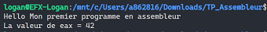

### Exercice 2 : Gnu is the best

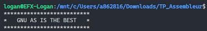

### Exercice 3 : Registres à zéro

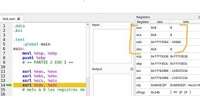

### Exercice 4 : Afficher 1 - 10

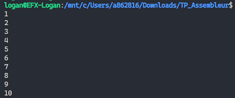

### Exercice 5 : Afficher les nombres pairs jusqu'à 20

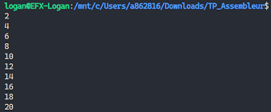

### Exercice 6 : Afficher les nombres premiers de 2 à 100

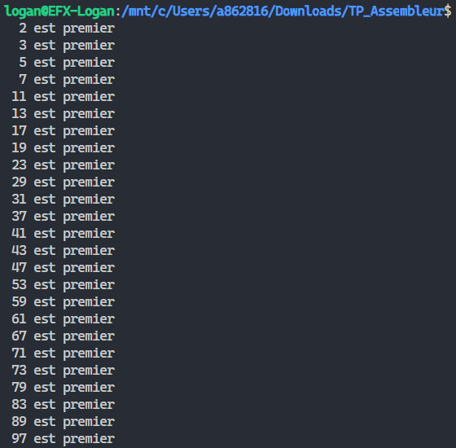

### Exercice 7 : Parcours de tableau

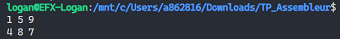

### Exercice 8 : Addition binaire

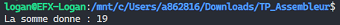

\newpage

### Exercice Bonus 1 : appel write()

Fichier : `PartieBonus_Exo1.s`

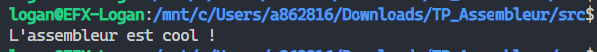

### Exercice Bonus 2 : création d'un fichier

Fichier : `PartieBonus_Exo2.s`

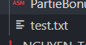

### Exercice Bonus 3 : afficher un fichier

Fichier : `PartieBonus_Exo3.s`

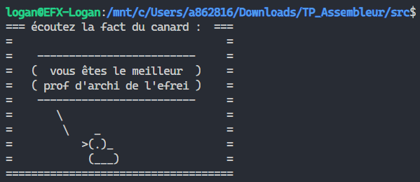