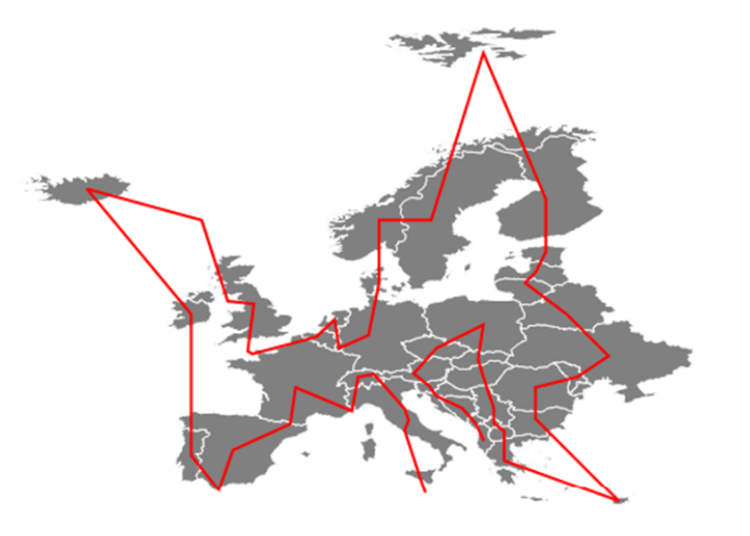
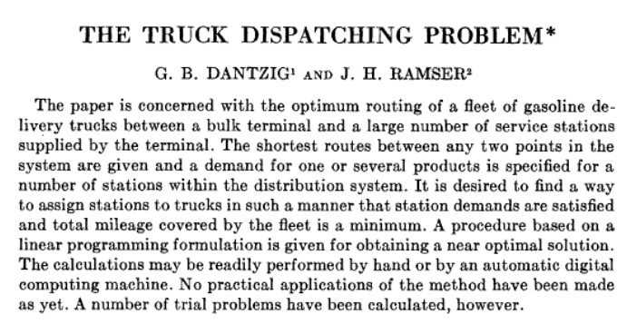
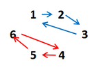

\hypersetup{colorlinks=true, allbordercolors={0 0 0}, pdfborderstyle={/S/U/W 1}}

## Introduction

Ce projet est mené dans le cadre du cours d’optimisation et complexité, sous la direction de Monsieur Ait El Mahjoub.

L’objectif consiste à définir et résoudre un problème d’optimisation étudié dans la littérature. L’outil d’optimisation IBM CPLEX Optimizer avec le langage de modélisation OPL, va nous permettre de solutionner le problème du voyageur de commerce.

## Définition du problème

{width=8cm}

Le problème du voyageur de commerce est sans doute un des problèmes mathématiques les plus connus en optimisation et graphes. Il consiste à trouver le chemin le plus court pour relier un ensemble donné de villes et en revenant au point de départ.

Formellement, étant donné un ensemble de villes et les distances entre chacune d’elles, le problème du voyageur de commerce consiste à trouver la plus courte tournée qui visite chaque ville exactement une fois et retourne au point de départ.

\newpage

## Revue de la littérature

Le problème du voyageur de commerce (aka. TSP pour Traveling Salesman Problem) est un problème complexe qui existe depuis plusieurs siècles. Au 19e siècle, William Rowan Hamilton pose ce problème sous la forme d’un jeu. Malgré la simplicité de l'énoncé du problème, il s'avère en réalité plutôt complexe à résoudre (appartient à la classe des NP-complets), et il a fallu attendre plusieurs dizaines d’années avant de voir des solutions apparaître.

Le problème du voyageur de commerce peut s'appliquer à différents domaines tels que la logistique, le transport de marchandises et de personnes, ou encore des problèmes d'ordonnancement. 

Malgré l'existence de solutions, il n’existe encore aucune solution *efficace* pour résoudre tous les cas du TSP dans un bon temps. De nombreuses recherches ont donc porté sur le développement d’algorithmes approximatifs, qui fournissent des solutions proches de la solution optimale. 

{width=8cm}

En 1956, Dantzig et Ramser proposèrent la première formulation mathématique du problème du TSP dans leur article "The truck dispatching problem" [^1]. C’est à partir de cet article que les chercheurs en informatique et en mathématiques appliquées ont donné beaucoup plus d‘importance à ce projet.

Une des meilleures solutions a été proposée en 1991 par Lin et Kernighan dans leur article “An effective heuristic algorithm for the traveling-salesman problem”. Cet algorithme est considéré comme l'un des meilleurs algorithmes heuristiques pour le TSP, et a été utilisé pour résoudre des instances de TSP avec jusqu'à 85 900 villes [^2].

En somme, le TSP est un problème encore ouvert et actif avec de nombreuses approches et méthodes proposées pour résoudre différentes variantes de ce problème. Les recherches futures devraient continuer à explorer de nouvelles méthodes pour résoudre ces problèmes, ainsi qu'à appliquer les solutions proposées dans de réels contextes pratiques...

[^1]: https://www.jstor.org/stable/2627477

[^2]: https://www.cs.princeton.edu/~bwk/btl.mirror/tsp.pdf

\newpage

## Modélisation mathématique du problème

On considère un graphe orienté, dont on stockera le poids dans une matrice $c_{i,j}$ (donnant la distance entre les villes $_i$ et $_j$). On considère également un nombre $I$ de villes.

En ce qui concerne le résultat, nous allons utiliser une matrice booléenne de taille identique, nommée $x_{i,j}$ (si on visite la ville $_j$ en partant de la ville $_i, alors on met la valeur associée à 1, 0 sinon).

> *Logiquement, nous avons les contraintes $\sum_{j \in I} c_{ij} > 0 \enspace (\forall _{i  \in I })$ et $x_{ij} \in \left\{ 0,1 \right\} (\forall _{i , j \in I })$ pour vérifier la cohérence des données. Par manque de pertinence, nous n'allons pas les ajouter dans la formule principale*

### Formulation linéaire de base [^3]

[^3]: http://web4.ensiie.fr/~faye/ESP_Dakar/SERPENT/Modele_voyageur_commerce.pdf

D'après l'énoncé précédent, nous pouvons construire la formule suivante :

$$
\quad Min(Z) =\sum_{i \in I} \sum_{j \in I}  c_{ij} * x_{ij}
\quad ; \quad
(C1)\quad \sum_{j \in I}   x_{ij} = 1 \enspace \forall _{i  \in I } 
\qquad
(C2)\quad \sum_{i \in I}   x_{ij} = 1 \enspace \forall _{j \in I }
$$

> *Minimiser $Z$ comme la somme des distance $c_{ij}$ pour les chemoins $x_{ij}$ choisis*  
> *(C1), (C2): Pour chaque ville de notre route, il faut y entrer ($_i$) et y sortir ($_j$) une unique fois*

Toutefois, ces deux seules contraintes ne suffisent pas à corriger le problème. En effet, il est possible que des sous-tours (plusieurs boucles) puissent apparaitre, comme montré sur la figure ci-dessous.



### Contrainte supplémentaire : sous-tours [^4]

[^4]: http://soutienintelligence.com/articlesbycategorypretty/22/69

Pour éviter ce problème, nous allons ajouter une contrainte supplémentaire qui va nous permettre de ne pas créer de sous-tours. Il existe trois méthodes classiques pour minimiser les sous-tours : Danzig-Fulkerson-Johnson (DFJ), Gavish-Graves (GG) et **Miller-Tucker-Zemlin (MTZ)**. Cette dernière est la plus intéressante à mettre en place avec du code OPL, car relativement compacte et simple (On introduirt une suite d’entiers $u_i$ allant de $0$ à $I$, $I$ étant le nombre de villes) : 

$$
(C3)\quad u_{i} - u_{j} + I * x_{ij} \leq I-1 \qquad \forall _{i , j \in I, \ j \neq 1, \ i \neq j}
$$

Exemple : Imaginons que nous avons $x_{4 5}$ $x_{5 6}$ et $x_{6 4}$ (parcours rouge dans la figure précédente). La contrainte MTZ va construire cette inégalité suivante : $u_4 < u_5 < u_6 < u_4$; or $u_6 > u_4$ donc l’inégalité n’est pas validée. Nous venons de détecter un sous-tour, donc la solution actuelle n’est pas valide.

Par soucis d'épurement, plutôt que de réécrire la formule complète, nous passons directement en application avec le langage de modélisation OPL.

\newpage

## Résolution du problème en OPL avec IBM CPLEX Optimizer

```
// 1 seule entrée nécessaire dans notre programme : le nombre de villes.
int nbVilles=4; // 2 4 9 16 25

// ----
// Définition de C, X et U (en minuscule), CF plus haut sur l'explication de ces variables
// ----
range listeIndex=1..nbVilles;
float c[i in listeIndex][j in listeIndex] = rand(100);
dvar boolean x[listeIndex][listeIndex];
dvar int+ u[listeIndex];

// ----
// Définition de la fonction objectif et de nos contraintes (tout est encore expliqué en haut)
// ----
minimize sum(i,j in listeIndex) c[i][j] * x[i][j];

subject to {
  // Contraintes de base (chaque ville a 1 entrée et 1 sortie)
  forall (j in listeIndex) sum(i in listeIndex) x[i][j] == 1;
  forall (i in listeIndex) sum(j in listeIndex) x[i][j] == 1;

  // Contrainte pour empêcher les sous-tours avec la méthode MTZ
  forall (i,j in listeIndex: j!=1) u[i] - u[j] + nbVilles * x[i][j] <= nbVilles-1;
}
``` 

![Résultat: dans la variable X. Sur des essais avec \[2, 4, 9, 16, 25\] villes, le nombre d'opération augmente au fur et à mesure](solutions.png){width=8cm}


## Conclusion

Pour conclure, le projet "le voyageur de commerce" a été une étude importante dans le monde des mathématiques. Bien que le sujet ait présenté des difficultés à appréhender, nous avons réussi, grâce à l'utilisation d'outils mathématiques et informatiques, à résoudre le problème pour un ensemble de villes données.
En déterminant la modélisation mathématique du problème, nous l'avons transposé sur un modèle OPL et lancé dans une simulation avec IBM CPLEX Optimizer.
En somme, le projet "le voyageur de commerce" a été un véritable défi défi, mais il nous a offert des enseignements précieux sur la manière de résoudre des problèmes mathématiques complexes en utilisant des outils adaptés